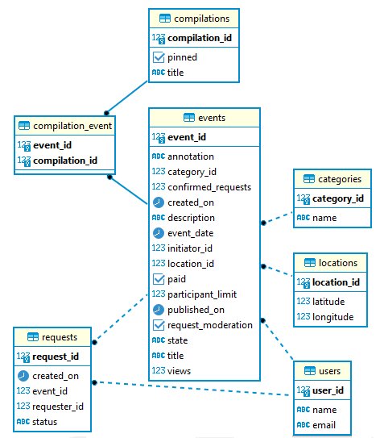
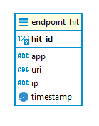

# Приложение ExploreWithMe (англ. «исследуй со мной»)

[Ссылка на pull request]()

## Описание

Приложение - афиша, где можно предложить какое-либо событие от выставки до похода в кино и набрать компанию для
участия в нём. Оно должно давать возможность делиться информацией об интересных событиях и помогать найти компанию для
участия в них.  
Приложение делится на два сервиса:

- Основной сервис — содержит всё необходимое для работы продукта;
- Сервис статистики — хранит количество просмотров и позволяет делать различные выборки для анализа работы приложения.

---

### Основной сервис

API основного сервиса имеет три части:

- публичная, доступна без регистрации любому пользователю сети;
- закрытая, доступна только авторизованным пользователям;
- административная, для администраторов сервиса.

[Подробная спецификация API основного сервиса](https://github.com/Ekaterina-Filaretova/java-explore-with-me/blob/main/ewm-main-service-spec.json)

_Диаграмма основного сервиса_

---

### Сервис статистики

- призван собирать информацию о количестве обращений пользователей к спискам событий;
- призван собирать информацию о количестве запросов к подробной информации о событии.

[Подробная спецификация API сервиса статистики](https://github.com/Ekaterina-Filaretova/java-explore-with-me/blob/main/ewm-stats-service-spec.json)

*Диаграмма сервиса статистики*

